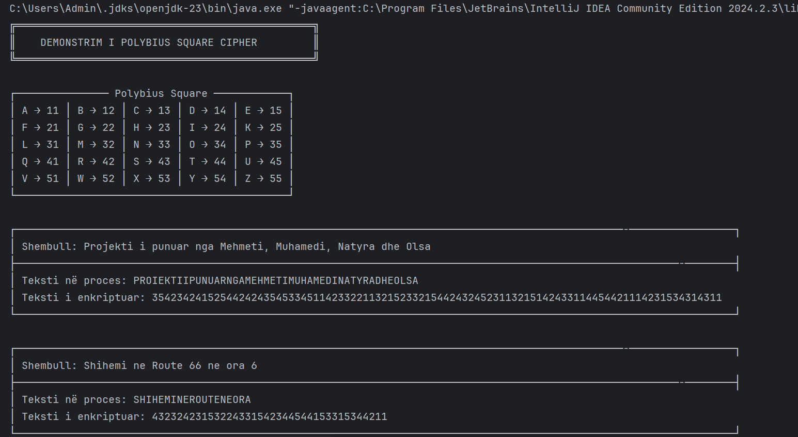
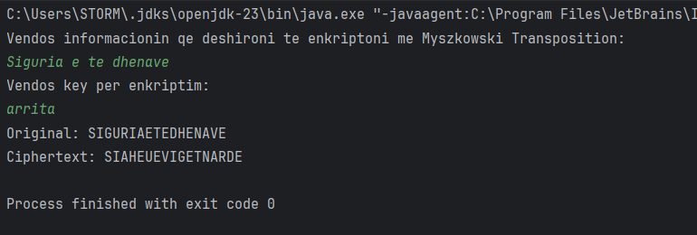

# SDH-Gr10 - Projekti 2

Ky projekt implementon dy algoritme enkriptimi/dekriptimi:

1. **Polybius Square Cipher**
2. **Myszkowski Transposition Cipher**

Të dy algoritmet janë implementuar në Java dhe janë krijuar për të demonstruar teknika bazike të enkriptimit/dekriptimit për sigurinë e të dhënave.

## **Udhëzime për Ekzekutimin e Programit**

1. **Klononi Repository-në**  
   Klononi repository-në në kompjuterin tuaj lokal duke përdorur Git:
   ```bash
   https://github.com/olsadomi/SDH-Gr10.git

2. **Hapni Projektin në një IDE**
   Hapni dosjen e projektit në IDE-në tuaj të preferuar (p.sh., IntelliJ IDEA ose VS Code).

3. **Kompiloni dhe Ekzekutoni Programin**
   Për të kompiluar dhe ekzekutuar programin, përdorni komandat e mëposhtme në terminal (sigurohuni që të jeni në dosjen e projektit):
   
   ```bash
   javac src/*.java
   java src.Main
   ```

   Po ashtu, mund ta ekzekutoni programin direkt nga IDE-ja duke klikuar butonin "Run".


   ## **Algoritmet**

### 1. **Polybius Square Cipher**

**Polybius Square Cipher** është një metodë e thjeshtë e enkriptimit që përdor një matricë 5x5 të shkronjave. Çdo shkronjë e mesazhit përfaqësohet nga një çift numrash, që janë koordinatat e rreshtit dhe kolonës në matricë.

### Shembull i Ekzekutimit - Enkriptimi



### 1.1 **Polybius Square Cipher Decryption**

### Shembull i Ekzekutimit - Dekriptimi

)


### 2. **Myszkowski Transposition Cipher** 
**Myszkowski Transposition Cipher** është një metodë enkriptimi që përdor një fjalë kyçe me shkronja të përsëritura për të riorganizuar tekstin. 
Teksti vendoset në një tabelë me kolona sipas çelësit, dhe kolonat lexohen në rendin që përcaktohet nga shkronjat e çelësit. 
Shkronjat e njëjta në çelës shkaktojnë që kolonat përkatëse të lexohen në të njëjtën radhë, duke e dalluar këtë metodë nga transpozimet e zakonshme.

### Shembull i Ekzekutimit të Myszkowski Transposition - Enkriptimi


